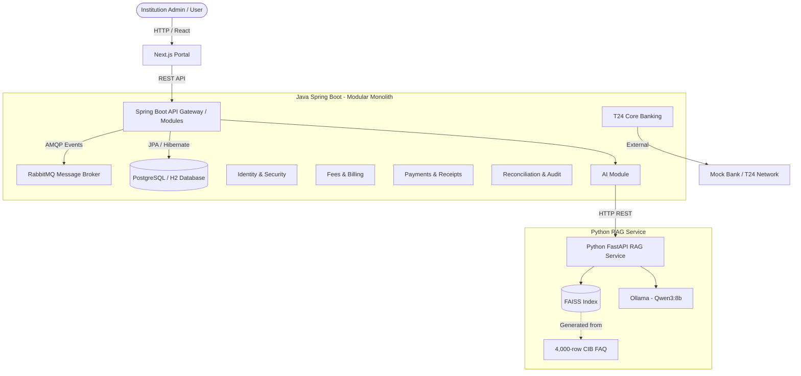

# Tuition Fees Network (CIB Institution Assistant) 🏦🎓

The **Tuition Fees Network** is a comprehensive full-stack solution designed for banking and institutional contexts (specifically integrating with CIB). It is built with a microservices-inspired **Modular Monolith** architecture on the backend, a modern **Next.js** frontend, and a dedicated **Python AI RAG Service** for intelligent, context-aware chatbot capabilities.

---

## 🏗️ High-Level Architecture



---

## 🛠️ Technology Stack

### **Frontend**
- **Framework:** Next.js (React)
- **Language:** TypeScript
- **Styling:** CSS / Vercel Geist Font

### **Backend (Java)**
- **Framework:** Spring Boot 3.x with Java 21
- **Architecture:** Spring Modulith (ensures strict boundaries between domain modules)
- **Database:** PostgreSQL (production) & H2 (in-memory for development/testing)
- **Message Broker:** RabbitMQ (via Spring AMQP) for event-driven asynchronous communication

### **AI & RAG Service (Python)**
- **Framework:** FastAPI (Uvicorn server)
- **Embeddings:** SentenceTransformers (`all-MiniLM-L6-v2`)
- **Vector Store:** FAISS (Facebook AI Similarity Search)
- **LLM Engine:** Ollama running the `qwen3:8b` model
- **Data Source:** Grounded purely on an approved 4,000-row CIB FAQ CSV.

---

## 🧠 Core Capabilities & Workflows

### **1. Event-Driven Financial Processing**
The backend utilizes **Spring Modulith** to maintain isolated domains. When a payment is processed, it avoids synchronous blocking by emitting domain events. These events are handled via **RabbitMQ (AMQP)**, ensuring reliable processing for downstream actions like generating receipts, updating student balances, and triggering notifications.

### **2. Automated Reconciliation**
The system features an automated reconciliation scheduler configured to run in 6-hour batch cycles (e.g., `00:00, 06:00, 12:00, 18:00`). This ensures that institutional ledgers remain perfectly synced with the core banking (T24) records.

### **3. Grounded AI Chatbot (RAG)**
Instead of a general-purpose LLM, the system implements a strict **Retrieval-Augmented Generation (RAG)** pipeline:
1. **Ingestion:** The Python service parses the CIB FAQ CSV and generates vector embeddings.
2. **Retrieval:** When a user asks a question, the request hits the Java `ai` module, which proxies to the Python FastAPI service.
3. **Similarity Search:** FAISS retrieves the most relevant FAQ chunks.
4. **Generation:** Ollama (Qwen3 8B) generates a response strictly grounded in the retrieved CIB context, reducing hallucinations and ensuring banking compliance.

---

## 🚀 Getting Started

### Prerequisites
- **Java 21** & Maven
- **Node.js** (v18+) & npm/yarn
- **Python 3.10+**
- **RabbitMQ** (running locally or via Docker)
- **Ollama** installed with the `qwen3:8b` model pulled (`ollama run qwen3:8b`)

### 1. Start the Backend (Spring Boot)
Ensure RabbitMQ is running, then start the Java backend:
```bash
./mvnw spring-boot:run
```

### 2. Start the AI RAG Service (FastAPI)
Navigate to the Python directory, install dependencies, and start the Uvicorn server:
```bash
cd python-rag
python3 -m venv venv
source venv/bin/activate
pip install -r requirements.txt
uvicorn app.main:app --reload --port 8000
```

### 3. Start the Frontend (Next.js)
Navigate to the frontend portal and run the development server:
```bash
cd frontend/apps/portal
npm install
npm run dev
```

---

## 📂 Directory Structure Snapshot

```text
/
├── frontend/
│   └── apps/portal/         # Next.js UI Application
├── src/main/java/           # Spring Boot Backend
│   └── com/tuitionnetwork/
│       ├── ai/              # AI Service Integration
│       ├── payments/        # Payment Processing
│       ├── reconciliation/  # Batch Reconciliations
│       ├── t24/             # Core Banking API
│       └── ...              # Other modular domains
├── python-rag/              # AI Service (FastAPI)
│   ├── app/                 # Chatbot APIs and FAISS logic
│   ├── data/                # CSV knowledge base
│   └── index/               # FAISS Vector Index
├── pom.xml                  # Maven configuration
└── README.md
```
