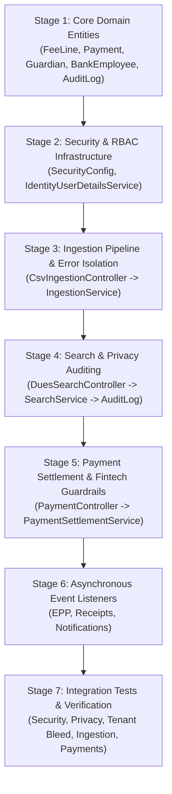

# Developer Onboarding & Technical Roadmap
## A Step-by-Step Guide for Engineers Joining the Tuition Network Project

Welcome to the **Tuition & Services Fees Collection Network** codebase! 

If you are a new software engineer joining this project and want to quickly understand what this system does, how all the modules fit together, and the exact path to read the code effectively, this guide is for you.

---

### Table of Contents
1. [The 5-Minute Mental Model](#1-the-5-minute-mental-model)
2. [The System Personas & Portals](#2-the-system-personas--portals)
3. [The Recommended 7-Stage Reading Path](#3-the-recommended-7-stage-reading-path)
4. [Method-by-Method Deep Dive: The Critical Engine Functions](#4-method-by-method-deep-dive-the-critical-engine-functions)
5. [The 4 "Fintech Paranoia" Guardrails](#5-the-4-fintech-paranoia-guardrails)
6. [Crucial Architectural Rules to Memorize](#6-crucial-architectural-rules-to-memorize)
7. [Local Development & Testing Quickstart](#7-local-development--testing-quickstart)

---

### 1. The 5-Minute Mental Model

Imagine a parent in Cairo who has one daughter in high school (*Nile International School*) and one son in a private primary school (*Cairo Modern Academy*). 
* **The Traditional Problem:** The parent receives separate tuition bills, bus fees, and book invoices through different channels (paper slips, cash, disparate bank accounts).
* **Our Solution:** 
  1. The parent or bank teller enters the parent's **14-digit Egyptian National ID** once.
  2. Our backend aggregates all unpaid fees across all their children and schools into a unified checkout dashboard.
  3. The parent can pay in full (Cash / Debit / Credit) or convert the tuition into a **3-month 0% promotional installment plan** or a **6, 12, or 18-month bank-backed Equal Payment Plan (EPP)**.
  4. Schools upload CSV fee rosters with automatic row-level error isolation and deduplication.
  5. Every search and upload operation is immutably audited for data privacy compliance.

```plaintext
┌───────────────────────────┐      ┌───────────────────────────┐      ┌───────────────────────────┐
│     Back-Office Portal    │      │     Institution Portal    │      │    Guardian Mobile App    │
│  (Bank Employee Counter)  │      │   (School Finance Admin)  │      │     (Parents & Family)    │
│   ROLE_BACK_OFFICE        │      │   ROLE_INSTITUTION_ADMIN  │      │       ROLE_GUARDIAN       │
└─────────────┬─────────────┘      └─────────────┬─────────────┘      └─────────────┬─────────────┘
              │                                  │                                  │
              ▼                                  ▼                                  ▼
┌─────────────────────────────────────────────────────────────────────────────────────────────────┐
│                           SECURITY & WEB LAYER (Spring Security 6)                              │
│         - SecurityFilterChain: /api/v1/** Authenticated (401 Unauthorized for Unauthenticated)  │
│         - @EnableMethodSecurity: Enforces Role-Based Access Control (@PreAuthorize)             │
└────────────────────────────────────────────────┬────────────────────────────────────────────────┘
                                                 │
                                                 ▼
┌─────────────────────────────────────────────────────────────────────────────────────────────────┐
│                                MODULAR MONOLITH APPLICATION CORE                                │
│                                                                                                 │
│   1. INGESTION  ──────────▶  2. BILLING  ◀──────────  3. SEARCH  ◀──────────  4. IDENTITY       │
│   (CSV Ingestion &          (FeeLine Ledger,          (Multi-Child           (BankEmployee,     │
│    Error Isolation)          Optimistic Lock)          Consolidation)         HMAC-SHA256 Hashing)
│                                     │                        │                       │          │
│                                     │                        ▼                       ▼          │
│                                     │                5. AUDIT LOG MODULE                        │
│                                     ▼                (Immutable Data Privacy Records)           │
│                              6. PAYMENTS ENGINE                                                 │
│                              - Idempotency & Payload Tamper Protection                          │
│                              - Non-Transactional Bank Gateway Authorization (chargeCard)        │
│                              - Atomic Balance Deduction & @Version Optimistic Locking           │
│                                     │                                                           │
│                                     ▼ (Publishes PaymentCapturedEvent)                          │
│                        ───────────────────────────────                                          │
│                        │              │              │                                          │
│                        ▼              ▼              ▼                                          │
│                     7. EPP       8. RECEIPTS   9. NOTIFICATIONS                                 │
│                   (Installment   (Crypto Sig    (Simulated SMS                                  │
│                    Schedules)     & PDF CDN)     Alerts)                                        │
└─────────────────────────────────────────────────────────────────────────────────────────────────┘
```

---

### 2. The System Personas & Portals

The application enforces strict **Role-Based Access Control (RBAC)** across three distinct personas:

| Persona | Database Entity | Spring Security Role | Allowed Operations | Forbidden Operations |
|:---|:---|:---|:---|:---|
| **Bank Employee** | [`BankEmployee`](file:///Users/nourahmed/Downloads/demo/src/main/java/com/tuitionnetwork/identity/domain/BankEmployee.java) | `ROLE_BACK_OFFICE` | Search National ID (`/api/v1/guardian/dues`), assist with counter payments. | Cannot upload institution files or access school-specific ledgers (`403 Forbidden`). |
| **School Admin** | [`InstitutionAdmin`](file:///Users/nourahmed/Downloads/demo/src/main/java/com/tuitionnetwork/identity/domain/InstitutionAdmin.java) | `ROLE_INSTITUTION_ADMIN` | Upload CSV fee rosters (`/api/v1/institutions/{id}/dues/upload`), view school student ledgers. | Cannot perform global National ID searches across other schools (`403 Forbidden`). |
| **Guardian / Parent** | [`Guardian`](file:///Users/nourahmed/Downloads/demo/src/main/java/com/tuitionnetwork/identity/domain/Guardian.java) | `ROLE_GUARDIAN` | View dependent children's dues, settle payments via web/mobile. | Cannot access back-office or institution admin endpoints (`403 Forbidden`). |

---

### 3. The Recommended 7-Stage Reading Path

To learn the codebase effectively, **do not read the files alphabetically**. Instead, follow this guided tour representing the lifecycle of data in the system:



---

#### Stage 1: The Core Domain Entities (The Data Foundation)
Start by understanding what data is stored in the database:
1. [`billing/domain/FeeLine.java`](file:///Users/nourahmed/Downloads/demo/src/main/java/com/tuitionnetwork/billing/domain/FeeLine.java): Represents an invoice line item owed by a student. Notice the `@Version` field (for optimistic locking) and `rowIdempotencyKey` (for CSV deduplication).
2. [`payments/domain/Payment.java`](file:///Users/nourahmed/Downloads/demo/src/main/java/com/tuitionnetwork/payments/domain/Payment.java): The master payment aggregate storing transaction reference, auth code, idempotency key, and total amount.
3. [`payments/domain/PaymentAllocation.java`](file:///Users/nourahmed/Downloads/demo/src/main/java/com/tuitionnetwork/payments/domain/PaymentAllocation.java): Junction entity that records how much of a payment was applied to which `FeeLine`.
4. [`identity/domain/Guardian.java`](file:///Users/nourahmed/Downloads/demo/src/main/java/com/tuitionnetwork/identity/domain/Guardian.java), [`InstitutionAdmin.java`](file:///Users/nourahmed/Downloads/demo/src/main/java/com/tuitionnetwork/identity/domain/InstitutionAdmin.java), and [`BankEmployee.java`](file:///Users/nourahmed/Downloads/demo/src/main/java/com/tuitionnetwork/identity/domain/BankEmployee.java): The 3 distinct user entity models.
5. [`audit/domain/AuditLog.java`](file:///Users/nourahmed/Downloads/demo/src/main/java/com/tuitionnetwork/audit/domain/AuditLog.java): Immutable compliance audit trail.
6. [`ingestion/domain/UploadError.java`](file:///Users/nourahmed/Downloads/demo/src/main/java/com/tuitionnetwork/ingestion/domain/UploadError.java): Records line-by-line parsing errors from CSV spreadsheets.

---

#### Stage 2: Security & Authentication Architecture
1. [`identity/security/SecurityConfig.java`](file:///Users/nourahmed/Downloads/demo/src/main/java/com/tuitionnetwork/identity/security/SecurityConfig.java): Configures method security (`@EnableMethodSecurity`), protects `/api/v1/**` endpoints, and returns `401 Unauthorized` for unauthenticated callers.
2. [`identity/security/IdentityUserDetailsService.java`](file:///Users/nourahmed/Downloads/demo/src/main/java/com/tuitionnetwork/identity/security/IdentityUserDetailsService.java): Multi-domain user details loader that assigns `ROLE_BACK_OFFICE`, `ROLE_INSTITUTION_ADMIN`, or `ROLE_GUARDIAN`.

---

#### Stage 3: Ingestion Pipeline & Error Isolation
Follow how schools upload their student fee rosters:
1. [`ingestion/web/CsvIngestionController.java`](file:///Users/nourahmed/Downloads/demo/src/main/java/com/tuitionnetwork/ingestion/web/CsvIngestionController.java): REST controller receiving multipart CSV files at `POST /api/v1/institutions/{id}/dues/upload` protected by `@PreAuthorize("hasRole('INSTITUTION_ADMIN')")`.
2. [`ingestion/service/IngestionService.java`](file:///Users/nourahmed/Downloads/demo/src/main/java/com/tuitionnetwork/ingestion/service/IngestionService.java): The validation engine:
   * Validates the 5-field row contract (National ID, Fee Type, Amount > 0, Currency == EGP, Future Collection Period).
   * Computes deterministic `row_idempotency_key = SHA256(Student + Institution + FeeType + Period)`.
   * Isolates invalid rows and persists them into [`UploadError`](file:///Users/nourahmed/Downloads/demo/src/main/java/com/tuitionnetwork/ingestion/domain/UploadError.java) entities without failing valid rows.
   * Inserts an `AUDIT_LOG` row for every CSV upload.
3. [`billing/service/BillingFeeCommandServiceImpl.java`](file:///Users/nourahmed/Downloads/demo/src/main/java/com/tuitionnetwork/billing/service/BillingFeeCommandServiceImpl.java): Saves valid rows as new `FeeLine` records while preventing duplicates.

---

#### Stage 4: Search & Privacy Auditing
Follow what happens when a bank employee looks up a parent:
1. [`search/web/DuesSearchController.java`](file:///Users/nourahmed/Downloads/demo/src/main/java/com/tuitionnetwork/search/web/DuesSearchController.java): Handles `GET /api/v1/guardian/dues` protected by `@PreAuthorize("hasRole('BACK_OFFICE')")`.
2. [`identity/service/IdentityResolverServiceImpl.java`](file:///Users/nourahmed/Downloads/demo/src/main/java/com/tuitionnetwork/identity/service/IdentityResolverServiceImpl.java):
   * Computes keyed **HMAC-SHA256** hash of the raw 14-digit National ID.
   * Extracts the authenticated Bank Employee ID.
   * Inserts an immutable privacy record into `AUDIT_LOG` containing the employee ID, action `"SEARCH_NATIONAL_ID"`, and the HMAC hash (*plaintext National ID is never logged*).
   * Queries `GuardianRepository.findByNationalIdHash(hmac)`.
3. [`search/service/SearchService.java`](file:///Users/nourahmed/Downloads/demo/src/main/java/com/tuitionnetwork/search/service/SearchService.java):
   * Coordinates the search and throws `ResponseStatusException(HttpStatus.NOT_FOUND)` if the National ID is missing.
   * Calls [`BillingFeeQueryService.findOpenFeesByStudentIds(...)`](file:///Users/nourahmed/Downloads/demo/src/main/java/com/tuitionnetwork/billing/service/BillingFeeQueryService.java) to pull and consolidate all open fee lines across schools.

---

#### Stage 5: Payment Settlement & Fintech Paranoia Guardrails
This is the financial core of the system:
1. [`payments/web/PaymentController.java`](file:///Users/nourahmed/Downloads/demo/src/main/java/com/tuitionnetwork/payments/web/PaymentController.java): Handles `POST /api/v1/payments/settle` with `Idempotency-Key`.
2. [`payments/service/PaymentSettlementService.java`](file:///Users/nourahmed/Downloads/demo/src/main/java/com/tuitionnetwork/payments/service/PaymentSettlementService.java):
   * **Fintech Guardrail 1 (Idempotency Tamper Protection):** If a duplicate key arrives with a modified total amount, rejects immediately with `409 Conflict`.
   * **Fintech Guardrail 2 (The Overpayment Block):** Asserts that `amountToPay <= remainingAmount` for every fee line.
   * **Fintech Guardrail 3 (EPP Debit Card Block):** Forbids Debit Cards from initiating EPP financing plans.
   * **Fintech Guardrail 4 (Post-Deadline Partial Payment Guard):** Forbids partial payments on overdue fees after deadline.
   * Calls `BankGatewayAdapterInterface.chargeCard(totalAmount, idempotencyKey)` **OUTSIDE** database transactions.
3. [`payments/service/PaymentTransactionExecutor.java`](file:///Users/nourahmed/Downloads/demo/src/main/java/com/tuitionnetwork/payments/service/PaymentTransactionExecutor.java):
   * Opens `@Transactional` boundary to update `FeeLine` balances (`@Version` optimistic locking check).
   * Atomically saves `Payment`, `PaymentAllocation`, and `PaymentStateLog`.
   * Publishes `PaymentCapturedEvent`.

---

#### Stage 6: Asynchronous Event Listeners (Fulfillment)
1. [`epp/EppScheduleGenerator.java`](file:///Users/nourahmed/Downloads/demo/src/main/java/com/tuitionnetwork/epp/EppScheduleGenerator.java): Listens via `@ApplicationModuleListener`. If payment method is `EPP_INSTALMENTS`, calculates interest/admin fees and saves `EPPSchedule`.
2. [`receipts/ReceiptGenerator.java`](file:///Users/nourahmed/Downloads/demo/src/main/java/com/tuitionnetwork/receipts/ReceiptGenerator.java): Calculates a SHA-256 digital signature and generates a downloadable PDF receipt URL.
3. [`notifications/PaymentNotificationService.java`](file:///Users/nourahmed/Downloads/demo/src/main/java/com/tuitionnetwork/notifications/PaymentNotificationService.java): Simulates SMS dispatch to the parent's phone.

---

#### Stage 7: Integration Tests & Verification
Review the test suites to see every guarantee verified:
1. [`SecurityIntegrationTest.java`](file:///Users/nourahmed/Downloads/demo/src/test/java/com/tuitionnetwork/identity/SecurityIntegrationTest.java): Verifies RBAC role boundaries (Institution Admin blocked from search; Bank Employee blocked from CSV upload; Unauthenticated rejected with 401).
2. [`PrivacyAuditIntegrationTest.java`](file:///Users/nourahmed/Downloads/demo/src/test/java/com/tuitionnetwork/audit/PrivacyAuditIntegrationTest.java): Verifies audit logs are saved even on missing records and never log plaintext IDs.
3. [`CrossInstitutionBleedIntegrationTest.java`](file:///Users/nourahmed/Downloads/demo/src/test/java/com/tuitionnetwork/billing/CrossInstitutionBleedIntegrationTest.java): Verifies multi-tenant boundary between schools.
4. [`CsvIngestionIntegrationTest.java`](file:///Users/nourahmed/Downloads/demo/src/test/java/com/tuitionnetwork/ingestion/CsvIngestionIntegrationTest.java): Verifies error isolation, row idempotency, and deduplication.
5. [`PaymentSettlementIntegrationTest.java`](file:///Users/nourahmed/Downloads/demo/src/test/java/com/tuitionnetwork/payments/PaymentSettlementIntegrationTest.java): Verifies idempotency, concurrent optimistic locking, partial payments, overpayment block, debit EPP block, and payload tamper protection.

---

### 4. Method-by-Method Deep Dive: The Critical Engine Functions

#### 1. Deterministic HMAC Hashing & Privacy Audit Logging
* **File:** [`IdentityResolverServiceImpl.java`](file:///Users/nourahmed/Downloads/demo/src/main/java/com/tuitionnetwork/identity/service/IdentityResolverServiceImpl.java#L67-L91)
* **Method:** `resolveGuardianByNationalId(String rawNationalId)`
* **What it does:**
  ```java
  @Override
  @PreAuthorize("hasRole('BACK_OFFICE')")
  public Optional<ResolvedGuardianDto> resolveGuardianByNationalId(String rawNationalId) {
      String hmac = computeHmacSha256(rawNationalId);
      UUID actorId = extractCurrentBankEmployeeId();

      // Privacy Tracking: Create and save AUDIT_LOG record (using HMAC, never plaintext)
      if (auditLogRepository != null) {
          auditLogRepository.save(new AuditLog(actorId, "BANK_EMPLOYEE", "SEARCH_NATIONAL_ID", hmac));
      }

      Optional<Guardian> guardianOpt = guardianRepository.findByNationalIdHash(hmac);
      if (guardianOpt.isEmpty()) {
          return Optional.empty(); // Strictly no mock fallback
      }
      // ...
  }
  ```

#### 2. CSV Row-Level Error Isolation
* **File:** [`IngestionService.java`](file:///Users/nourahmed/Downloads/demo/src/main/java/com/tuitionnetwork/ingestion/service/IngestionService.java#L63-L175)
* **Method:** `processCsvUpload(UUID institutionId, MultipartFile file)`
* **What it does:**
  Iterates over spreadsheet rows. If row 3 has a negative amount, it records an `UploadError` entity with the line number and reason. Valid rows compute `row_idempotency_key = SHA256(...)` and are forwarded to `BillingFeeCommandService` for idempotent insertion.

#### 3. Idempotent Payment Settlement & Non-Transactional Authorization
* **File:** [`PaymentSettlementService.java`](file:///Users/nourahmed/Downloads/demo/src/main/java/com/tuitionnetwork/payments/service/PaymentSettlementService.java#L46-L119)
* **Method:** `settlePayment(PaymentSettleRequest request, String headerIdempotencyKey)`
* **What it does:**
  1. Checks `paymentRepository.findByIdempotencyKey(key)`. If found, checks for payload tampering, then returns the saved payment without re-charging.
  2. Evaluates guardrails (Overpayment block, EPP Debit block, Post-deadline partial payment guard).
  3. Charges bank gateway adapter (`chargeCard`) **outside** the database transaction.
  4. Calls `PaymentTransactionExecutor` inside `@Transactional` to update `FeeLine` running balances, check `@Version` optimistic locks, and publish `PaymentCapturedEvent`.

---

### 5. The 4 "Fintech Paranoia" Guardrails

1. **Ledger RBAC Enforcement:**
   * School student ledgers (`/api/v1/institutions/{id}/students/{studentId}/dues`) are restricted to `ROLE_INSTITUTION_ADMIN`. Bank employees attempting access receive **`403 Forbidden`**.
2. **The Overpayment Guardrail:**
   * `paid_amount` can **never** exceed `remaining_amount`. Overpayment attempts are blocked before charging the bank adapter.
3. **The EPP Debit Card Block:**
   * Equal Payment Plans (EPP) are strictly restricted to Credit Cards. Submitting a Debit Card BIN prefix (`5078`, `5888`, `6703`, `4000`) is rejected.
4. **Idempotency Payload Tamper Protection:**
   * If a client re-uses an existing `Idempotency-Key` with an altered total amount or modified fee selection, the system rejects the request with **`409 Conflict`**.

---

### 6. Crucial Architectural Rules to Memorize

1. **Never Call External Bank APIs Inside a `@Transactional` Method:**
   * Network timeouts on bank APIs hold database connection locks open, exhausting Hikari connection pools. Always charge the bank outside the transaction, then open `@Transactional` to mutate database state.
2. **Never Log Plaintext 14-Digit Egyptian National IDs:**
   * Always log the HMAC-SHA256 hash in `AUDIT_LOG` and application logs.
3. **Zero Cross-Institution Data Bleed:**
   * All institution queries must be strictly filtered by `institution_id`.
4. **Never Mask Database Lookups with Mock Fallbacks:**
   * If a record is not in the database, return `Optional.empty()` or throw `404 Not Found`.

---

### 7. Local Development & Testing Quickstart

To run the complete test suite (42 unit and integration tests):
```bash
./mvnw clean test
```

To run individual integration test suites:
```bash
# Security & RBAC Enforcement Tests
./mvnw test -Dtest=SecurityIntegrationTest

# Privacy Auditing Tests
./mvnw test -Dtest=PrivacyAuditIntegrationTest

# Cross-Institution Tenant Bleed Tests
./mvnw test -Dtest=CrossInstitutionBleedIntegrationTest

# CSV Ingestion Resiliency Tests
./mvnw test -Dtest=CsvIngestionIntegrationTest

# Payment Settlement & Fintech Paranoia Tests
./mvnw test -Dtest=PaymentSettlementIntegrationTest
```
