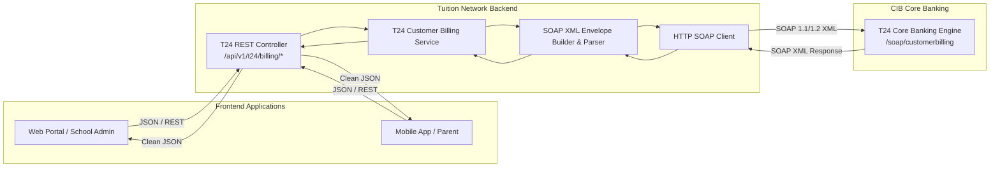
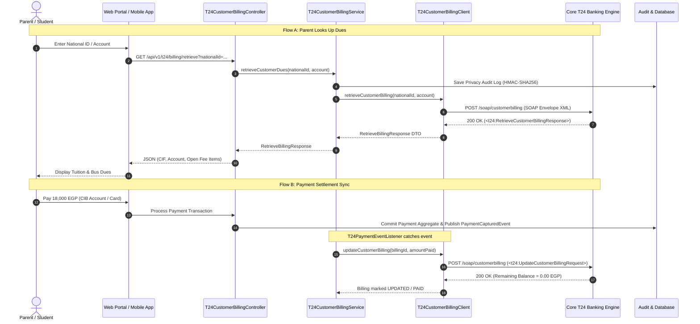

# Understanding the T24 Integration: A Plain-Language & Technical Guide

> **Audience**: Product Managers, Developers, QA Engineers, Business Analysts, and Stakeholders  
> **Repository**: `tuition-fees-network`  
> **Related Documents**:
> - [T24 Integration Operation Mapping](file:///Users/nourahmed/Downloads/demo/docs/T24%20Integration.csv)
> - [T24 Sample Payloads & Technical Envelopes](file:///Users/nourahmed/Downloads/demo/docs/T24_SAMPLE_PAYLOADS.md)
> - [Master Specification](file:///Users/nourahmed/Downloads/demo/docs/1_MASTER_SPEC.md)
> - [System Architecture Guide](file:///Users/nourahmed/Downloads/demo/docs/SYSTEM_ARCHITECTURE_GUIDE.md)

---

## 1. What is T24? (The Executive Summary)

In simple terms: **Temenos T24 is the central banking computer engine used by CIB (Commercial International Bank)**.

Whenever you open a bank account, transfer money, check your balance, or pay a bill at CIB, it is **T24** running behind the scenes that holds your money, verifies your identity, and records the accounting ledger.

### Why does our Tuition Fees Network need T24?
In our application:
- Schools upload student tuition bills.
- Parents log in to view what they owe and pay using their CIB bank accounts or credit cards.
- The bank needs to know:
  1. *Who is this customer? What are their outstanding tuition bills?*
  2. *Can the school create official billing dues recognized by the bank?*
  3. *When a parent pays, how does the bank update their balance and mark the bill as paid?*

**T24 is the bank source of truth that answers all three questions.**

---

## 2. The Core Problem We Solved: The "Language Barrier"

There is a fundamental communication difference between modern web applications and traditional core banking engines:

| Feature | Modern Web & Mobile Apps | Core Banking System (T24) |
| :--- | :--- | :--- |
| **Language** | **JSON** (`{"name": "Yousef"}`) | **XML / SOAP** (`<t24:Name>Yousef</t24:Name>`) |
| **Protocol** | Lightweight **REST** (HTTP GET / POST) | Heavy **SOAP Envelopes** with WS-Security |
| **Speed** | Instant, asynchronous, lightweight | Rigid, schema-strict, mainframe processing |
| **Direct Access** | **Never allowed** (major security risk) | Hidden inside bank intranet / VPN |

### Our Solution: The T24 REST Adapter Layer
Instead of forcing our frontend web and mobile apps to speak complex XML or exposing T24 directly to the internet, we built an **Adapter Layer** inside our backend server.



1. The frontend asks for data using clean, familiar **JSON** (e.g., `GET /api/v1/t24/billing/retrieve?nationalId=2980515...`).
2. Our backend adapter packages the request into a **signed, secure SOAP XML envelope** with WS-Security headers (`Username`, `Password`, `ChannelId=CIB_TUITION_NETWORK`).
3. The adapter sends the XML to T24, receives the bank's XML response, parses it safely, and converts it back into clean **JSON** for the frontend.

---

## 3. The Three Core Procedures Explained

The T24 integration revolves around **three essential procedures**:

```
+-------------------------------------------------------------------------+
|                       T24 CUSTOMER BILLING ADAPTER                      |
+------------------------------------+------------------------------------+
| Operation                          | What It Does                       |
+------------------------------------+------------------------------------+
| 1. RetrieveCustomerBillingProcedure | READ: Find student fees for parent |
| 2. RequestCustomerBillingProcedure  | CREATE: Register new school bill   |
| 3. UpdateCustomerBillingProcedure   | UPDATE: Mark bill paid or reduced  |
+------------------------------------+------------------------------------+
```

---

### Procedure 1: `RetrieveCustomerBillingProcedure` (Read)
* **Real-World Meaning**: *"Show me what this parent owes."*
* **When it runs**:
  - When a parent logs into their mobile app or web portal and inputs their National ID or CIB Account Number.
  - When a bank teller or back-office employee searches for a customer's open dues.
* **What happens**:
  - T24 looks up the customer profile (CIF) associated with that National ID or account.
  - It returns the customer's name, active account number, total outstanding balance, and an itemized breakdown of every child's fees (tuition, bus, books, activities).
* **Endpoints**:
  - **SOAP**: `<t24:RetrieveCustomerBillingRequest>`
  - **REST Adapter**: `GET /api/v1/t24/billing/retrieve?nationalId=29805150101023&accountNumber=100012345678`

---

### Procedure 2: `RequestCustomerBillingProcedure` (Create)
* **Real-World Meaning**: *"Register a new tuition bill in the bank's computer."*
* **When it runs**:
  - When a school administrator uploads a CSV/Excel roster of fees.
  - When the system creates annual tuition, term installments, or bus fees for the academic semester.
* **What happens**:
  - The adapter tells T24: *"School SCH-001 has issued a 25,000 EGP tuition fee for student Karim Amr with National ID 31005120104921 due on 2026-10-01."*
  - T24 registers the bill in the core banking system and returns a unique **`billingId`** (e.g., `BILL-2026-00918`).
* **Endpoints**:
  - **SOAP**: `<t24:RequestCustomerBillingRequest>`
  - **REST Adapter**: `POST /api/v1/t24/billing/request`

---

### Procedure 3: `UpdateCustomerBillingProcedure` (Update)
* **Real-World Meaning**: *"Apply this payment to the student's bill."*
* **When it runs**:
  - When a parent pays via CIB account debit, credit card, or converts the payment into an Easy Payment Plan (EPP installment).
* **What happens**:
  - The adapter sends the payment details to T24: the `billingId`, amount paid (e.g., `18,000.00 EGP`), and payment transaction reference (`TXN-2026-0981`).
  - T24 deducts the amount from the student's balance.
  - If the remaining balance reaches `0.00`, T24 marks the billing item as **PAID**; if partial, it records the new remaining amount.
* **Endpoints**:
  - **SOAP**: `<t24:UpdateCustomerBillingRequest>`
  - **REST Adapter**: `POST /api/v1/t24/billing/update` (and `PUT /api/v1/t24/billing/update`)

---

## 4. Key Engineering Features & Safeguards

To ensure this adapter is production-ready, bank-grade, and resilient, we built several critical architectural features:

### 1. Offline & Local Fallback Simulation (`t24.mock.fallback-to-local=true`)
- **Problem**: During local testing, CI/CD automated test builds, or staging demos, an external T24 core banking mainframe or mock server might be offline or unreachable over VPN.
- **Solution**: The adapter includes a built-in **deterministic local simulator**. If the HTTP connection to T24 times out or fails, the client automatically generates valid mock data with realistic CIFs, accounts, and billing records.
- **Benefit**: The entire platform runs with **100% reliability**, never crashing tests or blocking frontend developers when the bank mock is down.

### 2. Hardened XML Security (Anti-XXE Protection)
- **Problem**: Parsing external XML documents can expose servers to XML External Entity (XXE) injection attacks and Billion Laughs denial-of-service exploits.
- **Solution**: The XML DOM parser is configured with:
  - `XMLConstants.FEATURE_SECURE_PROCESSING = true`
  - `disallow-doctype-decl = true`
  - Disabled external DTDs and stylesheet compilation.

### 3. Banking Privacy & Audit Logging
- **Problem**: Egyptian banking privacy regulations and Central Bank guidelines strictly forbid storing raw National IDs in plain text inside application audit trails.
- **Solution**: Whenever the adapter performs an operation, it logs the event in the `AUDIT_LOG` table with an **HMAC-SHA256 one-way cryptographic hash** (e.g., `HMAC:a8f9c...`) rather than plain national IDs.

### 4. Automatic Event-Driven Payment Synchronization
- **Problem**: What happens when a parent pays through the normal payment checkout flow?
- **Solution**: The adapter includes an event listener (`T24PaymentEventListener`) that subscribes to `PaymentCapturedEvent`. Whenever any payment is settled in the system, it automatically notifies T24 in the background without slowing down the user experience.

---

## 5. End-to-End Workflow Diagram



---

## 6. Codebase File Directory

All code created for this integration is cleanly organized in the `com.tuitionnetwork.t24` package:

| File | Purpose |
| :--- | :--- |
| [`T24BillingDto.java`](file:///Users/nourahmed/Downloads/demo/src/main/java/com/tuitionnetwork/t24/dto/T24BillingDto.java) | Data Transfer Objects (Records) for Requests and Responses of all 3 procedures. |
| [`T24SoapEnvelopeBuilder.java`](file:///Users/nourahmed/Downloads/demo/src/main/java/com/tuitionnetwork/t24/client/T24SoapEnvelopeBuilder.java) | Constructs SOAP 1.1 / 1.2 XML envelopes and parses XML responses with anti-XXE safeguards. |
| [`T24CustomerBillingClient.java`](file:///Users/nourahmed/Downloads/demo/src/main/java/com/tuitionnetwork/t24/client/T24CustomerBillingClient.java) | Interface defining SOAP communication contracts. |
| [`T24CustomerBillingClientImpl.java`](file:///Users/nourahmed/Downloads/demo/src/main/java/com/tuitionnetwork/t24/client/T24CustomerBillingClientImpl.java) | HTTP client implementation with timeout controls and deterministic offline fallback. |
| [`T24CustomerBillingService.java`](file:///Users/nourahmed/Downloads/demo/src/main/java/com/tuitionnetwork/t24/service/T24CustomerBillingService.java) | Business logic interface for customer billing procedures. |
| [`T24CustomerBillingServiceImpl.java`](file:///Users/nourahmed/Downloads/demo/src/main/java/com/tuitionnetwork/t24/service/T24CustomerBillingServiceImpl.java) | Implementation with privacy-preserving audit logging and dynamic WSDL generation. |
| [`T24CustomerBillingController.java`](file:///Users/nourahmed/Downloads/demo/src/main/java/com/tuitionnetwork/t24/web/T24CustomerBillingController.java) | REST endpoints exposing `/api/v1/t24/billing/**` with Spring Security enforcement. |
| [`T24PaymentEventListener.java`](file:///Users/nourahmed/Downloads/demo/src/main/java/com/tuitionnetwork/t24/event/T24PaymentEventListener.java) | Spring Event Listener that automatically syncs payments with T24 balance reductions. |
| [`T24SoapEnvelopeBuilderTest.java`](file:///Users/nourahmed/Downloads/demo/src/test/java/com/tuitionnetwork/t24/T24SoapEnvelopeBuilderTest.java) | Unit tests verifying SOAP XML serialization and parsing. |
| [`T24CustomerBillingIntegrationTest.java`](file:///Users/nourahmed/Downloads/demo/src/test/java/com/tuitionnetwork/t24/T24CustomerBillingIntegrationTest.java) | Integration test suite verifying REST endpoints, WSDL, security, and event wiring. |
| [`docs/T24_SAMPLE_PAYLOADS.md`](file:///Users/nourahmed/Downloads/demo/docs/T24_SAMPLE_PAYLOADS.md) | Technical reference containing copy-pasteable XML envelopes and JSON payloads. |

---

## 7. Summary & Takeaway

- **What did we build?** A bridge between modern tuition payment applications and CIB's core banking computer (T24).
- **Why?** So parents can view real banking dues, schools can issue official billing items, and payments instantly update balances at the bank.
- **How?** By wrapping complex SOAP XML banking protocols behind simple, secure REST JSON APIs with offline resilience and privacy protections.
