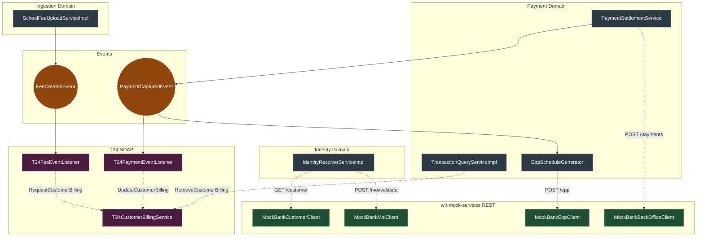

# Architecture & Integration Guide: Mock Bank and T24

This document outlines how the internal Tuition Network Spring Boot application integrates with external systems: the REST-based `wit-mock-services` (simulating the bank gateway) and the SOAP-based `T24` core banking system.

---

## 1. Architectural Philosophy

The application strictly adheres to the **Anti-Corruption Layer (ACL)** and **Backend-For-Frontend (BFF)** patterns. 
- The frontend ONLY communicates with the internal Java Backend.
- The Java Backend acts as an orchestrator, isolating the frontend from external API structures.
- Spring Modulith and Spring Application Events are used to ensure that internal domains (like Ingestion or Payments) do not tightly couple to external adapters (like T24).

---

## 2. Integration: `wit-mock-services` (REST APIs)

The `wit-mock-services` provide 5 distinct RESTful endpoints simulating standard bank gateway operations. The backend uses `RestTemplate` within dedicated client classes to consume these APIs.

### A. MOI Validation (Mock Service 1) — (`MockBankMoiClient`)
**Purpose:** To validate an Egyptian national ID against the Ministry of Interior registry.
**API Call:**
- `POST /api/v1/moi/validate`
- **Headers:** `X-API-Key: {mockbank.api.key}`
**How the Code Uses It:**
1. **The Entry Point:** In `IdentityResolverServiceImpl.java`.
2. **The Execution:** Called during Guardian resolution to strictly validate the National ID before returning Guardian or Student details. 
3. **Design Choice:** The payload deliberately omits the optional `full_name` field. The Python mock server implements a strict name-similarity matching algorithm that would reject the request if the provided name didn't match the internal MOI seed data. Omitting it ensures reliable ID validation based solely on ID format and lifecycle state (e.g. not blocked or deceased).

### B. Card Payment (Mock Service 2) — (`MockBankBackOfficeClient`)
**Purpose:** To authorize and capture a standard credit/debit card payment (e.g., via the School Portal checkout).
**API Call:**
- `POST /api/v1/payments/cards`
- **Headers:** `X-API-Key: {mockbank.api.key}`, `Idempotency-Key: {idempotencyKey}`
**How the Code Uses It:**
1. **The Entry Point:** In `BackOfficePaymentServiceImpl`, when a user submits a payment with `CREDIT_CARD` method.
2. **The Execution:** The service calls `MockBankBackOfficeClient.processCardPayment(...)` passing the card details and amount.
3. **The Response:** The mock bank processes the charge. If successful (`status: AUTHORISED` or `CAPTURED`), the Java backend generates a local `Payment` record and receipt. It includes a fallback simulation mechanism if the external endpoint is unreachable (e.g. returning `AUTH-SIM-` keys).

### C. Equal Payment Plans (EPP) (Mock Service 3) — (`MockBankEppClient`)
**Purpose:** To retrieve dynamic interest rates, quote generation, and amortization schedules for installment-based payments.
**API Calls:**
1. `GET /api/v1/epp/quotes?amount={amount}` (Fetches available tenors and monthly rates - uses a local fallback if unreachable)
2. `POST /api/v1/epp` (Registers an EPP plan against a specific external payment ID - strictly integrated with no fallback)
- **Headers:** `X-API-Key: {mockbank.api.key}`
**How the Code Uses It:**
- **Back Office Simulation:** `EppPlanServiceImpl` calls `getQuotes(amount)` to fetch pricing, passing a standardized `EppQuoteResponse` to the frontend.
- **Post-Payment Generation:** Upon successful EPP payment, `EppScheduleGenerator` listens for a `PaymentCapturedEvent`, calls `createPlan`, and saves the returned amortization schedule to the local DB. It explicitly uses the `transactionReference` returned by the MockBank as the identifier to prevent `404 Not Found` errors in the mock server.

### D. Customer Lookup (Mock Service 4) — (`MockBankCustomerClient`)
**Purpose:** To fetch a customer's banking footprint (active accounts and credit cards) from CIB using their National ID.
**API Call:**
- `GET /api/v1/customer/{nationalId}`
- **Headers:** `X-API-Key: {mockbank.api.key}`
**How the Code Uses It:**
1. **The Entry Point:** In `IdentityResolverServiceImpl.java`.
2. **The Execution:** Called during Guardian resolution. It maps the first `ACTIVE` bank account and credit card from the Mock Bank and saves them into the local `Guardian` entity (`linkedAccountId` and `linkedCardId`).
3. **Resilience:** Executed in a `try-catch`. If the API fails, it ignores the error and continues locally (Defensive Integration).

### E. Back-office Payment (Mock Service 5) — (`MockBankBackOfficeClient`)
**Purpose:** To deduct money directly from an account or card the customer already holds on file, typically executed by a Bank Teller (OTC).
**API Call:**
- `POST /api/v1/backoffice/payments`
- **Headers:** `X-API-Key: {mockbank.api.key}`, `Idempotency-Key: {idempotencyKey}`
**How the Code Uses It:**
1. **The Entry Point:** When a bank teller processes a payment via `CIB_ACCOUNT` or `SAVED_CARD`.
2. **The Execution:** `BackOfficePaymentServiceImpl` calls `MockBankBackOfficeClient.processBackOfficePayment(...)` passing the `sourceId` (e.g., `acc_123` or `card_456`).
3. **The Response:** The Python server validates the specific account/card. If valid and funded, it deducts the balance and returns success, allowing the Java app to settle the fee.

---

## 3. Integration: `T24 Core Banking System` (SOAP APIs)

The `t24` module acts as an Anti-Corruption Layer (ACL). It isolates the messy XML/SOAP structures required by T24 from the clean internal domain models. It relies on the `T24CustomerBillingClient` to execute SOAP requests.

### A. Live Dues Aggregation (`RetrieveCustomerBilling`)
**Purpose:** To fetch real-time outstanding dues directly from the T24 ledger.
**API Call:**
- **SOAP Action:** `RetrieveCustomerBilling`
- **Inputs:** `National ID`, `Account Number`
**How the Code Uses It:**
1. **The Flow:** In `TransactionQueryServiceImpl`, a Bank Agent queries a customer's profile.
2. **Local Fetch:** The system queries the local `FeeLine` repository.
3. **Remote Fetch:** It simultaneously calls `T24CustomerBillingService.retrieveCustomerDues(...)`.
4. **Aggregation:** It merges the T24 XML response into standard `CustomerFeeItemDto` objects alongside the local fees, giving the frontend a unified view.

### B. Asynchronous Fee Registration (`RequestCustomerBilling`)
**Purpose:** To inform T24 that a new debt/fee has been assigned to a customer via the School Portal.
**API Call:**
- **SOAP Action:** `RequestCustomerBilling`
- **Inputs:** `Institution Code`, `Student Details`, `Fee Amount`, `Due Date`
**How the Code Uses It:**
1. **The Trigger:** A CSV fee upload is processed by `SchoolFeeUploadServiceImpl`.
2. **The Event:** It publishes a `FeeCreatedEvent`.
3. **The Listener:** `T24FeeEventListener` receives this asynchronously, maps the local `FeeLine` into a `RequestBillingRequest`, and fires it to T24 via SOAP. 

### C. Payment Settlement Synchronization (`UpdateCustomerBilling`)
**Purpose:** To notify T24 that a customer has successfully paid an outstanding due, ensuring the core ledger balances match the Tuition Network.
**API Call:**
- **SOAP Action:** `UpdateCustomerBilling`
- **Inputs:** `Billing ID`, `Amount Paid`, `Payment Method`, `Transaction Reference`
**How the Code Uses It:**
1. **The Trigger:** A payment is settled locally.
2. **The Event:** `PaymentSettlementService` publishes a `PaymentCapturedEvent`.
3. **The Listener:** `T24PaymentEventListener` iterates through the allocated fees and calls `syncPaymentSettlement(...)`, sending the transaction reference and exact amount paid to T24 to clear the core debt.

---

## 4. Summary of Event Flows

By leveraging Spring Modulith and Spring Events, the codebase achieves high decoupling. Here is the visual flow of integration:

